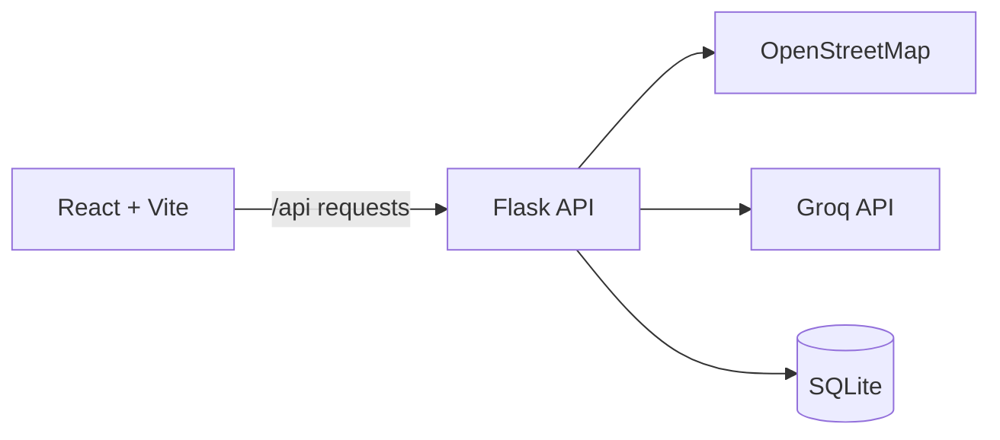

# SmartLead

**Dolphin Hacks 2026 — Business Track Winner**

SmartLead is a hackathon-built lead discovery and qualification platform. A user describes their business, target customer, service, and location; SmartLead finds nearby businesses, evaluates their fit, estimates potential deal value, and suggests outreach steps.

> Built as a three-person, 12-hour hackathon prototype at the MLH-sponsored Dolphin Hacks 2026.

## Features

| Feature | Description |
| --- | --- |
| Local lead discovery | Finds real nearby businesses using OpenStreetMap |
| AI qualification | Scores and explains each lead's potential fit |
| Deal estimates | Provides estimated monthly and annual value |
| Outreach planning | Generates a four-step contact strategy |
| Lead management | Saves selected leads in SQLite |
| Dashboard tools | Filters, sorts, and exports results to CSV |

## Architecture



The browser never receives the Groq credential. AI requests are sent through the Flask backend, which reads its key from a local environment file.

## Tech Stack

- **Frontend:** React 18, Vite 5, CSS
- **Backend:** Python, Flask, Flask-CORS
- **Data:** SQLite, OpenStreetMap Nominatim and Overpass
- **AI:** Groq API

## Run Locally

### 1. Backend

```bash
cd backend
python -m venv .venv
# Windows: .venv\Scripts\activate
# macOS/Linux: source .venv/bin/activate
pip install -r requirements.txt
copy .env.example .env
```

Edit `backend/.env` and add your own Groq key:

```dotenv
GROQ_API_KEY=your_key_here
GROQ_MODEL=llama-3.3-70b-versatile
```

Then run:

```bash
python server.py
```

The API runs at `http://localhost:5500`.

### 2. Frontend

```bash
cd client
npm install
npm run dev
```

The app runs at `http://localhost:3000`; Vite proxies `/api` requests to Flask.

## API Routes

| Method | Route | Purpose |
| --- | --- | --- |
| GET | `/` | API health and service information |
| POST | `/api/chat` | LeadBot conversation |
| POST | `/api/generate` | Generate and qualify leads |
| GET | `/api/leads` | List generated leads |
| POST | `/api/save` | Save a lead |
| GET | `/api/saved` | List saved leads |
| GET | `/api/stats` | Pipeline statistics |
| GET | `/api/search/<search_id>` | Retrieve one search |
| GET | `/api/chat/stats` | Chat usage statistics |

## Prototype Limitations

SmartLead was built during a 12-hour hackathon. It is not production SaaS: AI-generated analysis should be validated, external APIs can be rate-limited or unavailable, and the project does not include production authentication, authorization, monitoring, or deployment hardening.

## Contributors

See the repository's [contributors](https://github.com/FurkanSource/csihackathon/graphs/contributors).
